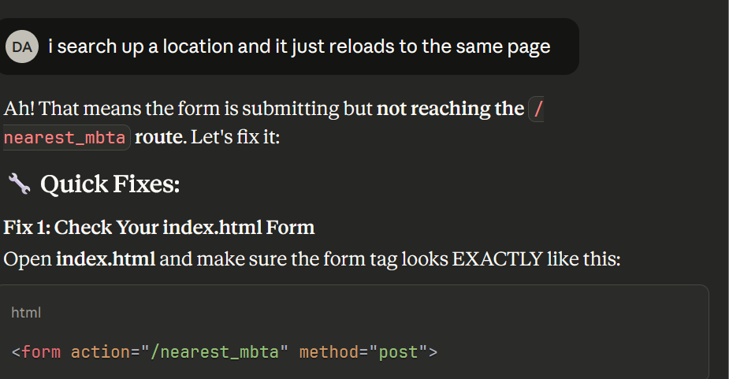
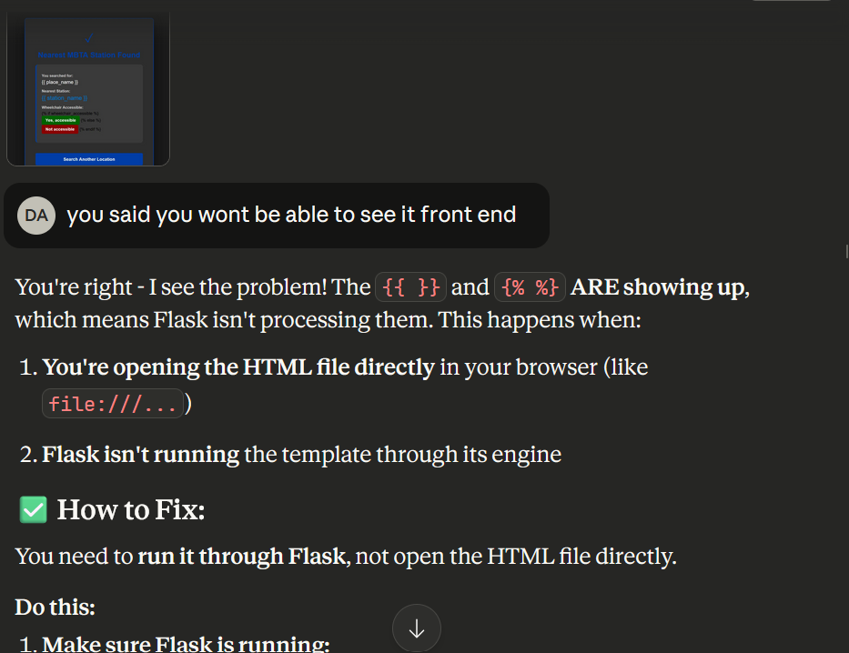
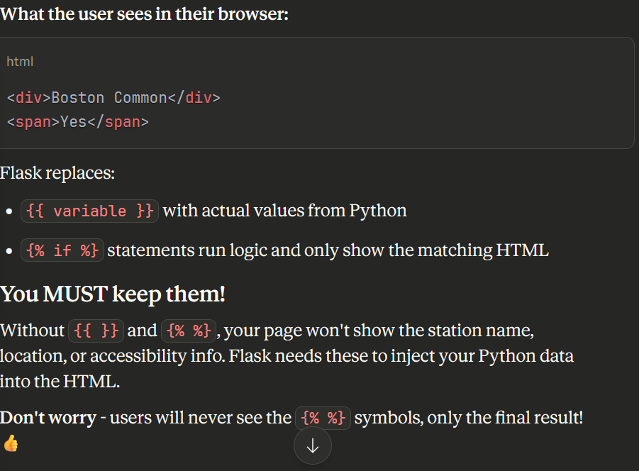
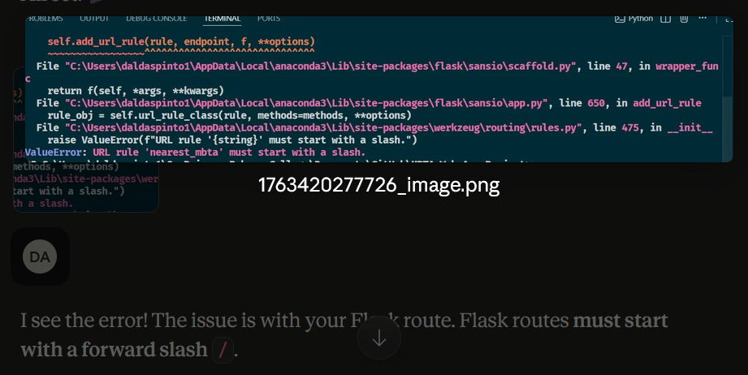

# MBTA-Web-App-Project

## Project Overview 
The main goal of the MBTA station finder is to help its users locate the nearest MBTA location at any location within the greater Boston Area. In addition to providing that information It will also let the user know if the station is wheelchair accessible as well as providing any sporting events or concert events around that location through Ticketmaster.
Some of the core features include location geocoding which converts the place name into coordinates through the Mapbox API. MBTA station lookup , it finds the nearest T station using the MBTA API. There is also an error handeling page with suggestions and information on if the station is wheelchair accessible . In terms of extensions to the project I included simple JavaScript features to have expandable event cards , local storage and live input validation. Along with that I included Ticketmaster's API to show upcoming concerts and sport events within the area. 

### Reflection
The key for this project working mostly smooth was breaking up API integration into smaller pieces that I could test along the way, I did this by splitting everything into functions so I could test pieces by itself before connecting everything into one working piece. Using `pprint` to visualize JSON structures helped me understand the API responses better. Testing my API URL's directly in the browser before coding helped me catch API errors early. In terms of challanges was using the MBTA AP because it requires specific filter syntax such as `filter[latitude]`which I didn't expect and of course I had a bug in my HTML form where I at first had `actions=""` instead of `actions="/nearest_mbta` and it caused the page to run but just reload and not show any MBTA information. In terms of approach the `pprint.pprint()` helped me trace through JSON structure when needed. Again I did run test on API's used seperately to make sure they ran the way they needed to on `python mbta_helper.py`. If I had to change something when doing this project again I would switch the way I do my forms to follow the good practice of including input validation from the start instead of having to go back in at the end and fix it. In order to manage my task I worked on the project through a couple of days the first day I collected AI keys the ones I knew I wanted to add and implemnted the `mbta_helper.py` file to test required functions as well as other backend work surronding JSON. On day 2 I created the `app.py` file and built the basic HTML code for the 3 pages I needed. On day 3 I adding the styling through CSS and ineractivity through JavaScript and on the last day I documented my work and tested a few locations to make sure the files worked and looked like I wanted them to. 

#### Use of AI tools
I used Claude AI to help me parse JSON responses as well as the local storage aspect for saving the data in Browser and to help me format and debug some of the python and JavaScript code to implement what aspects I wanted my HTML files to have. AI also helped me debug when my form wasnt submitting correctly it helped me find that I had done the `action` attribute incorrectly I also used AI with the dark them because I could not find the correct shade of black using RBG so I used suggestions from AI to put in the numbers that gave me the shade I wanted I also included screenshots of Errors I recived while running pages to AI and it told me what each error meant and how I could fix my code . When I was given code I did not understand I got clarification from claude because I asked it to explain the code which it did through comments on its suggestion on what the code means and what I should expect when running to make sure I am understanding the new pieces of code I am integrating into this project. 
**Specific Examples:**
- I was stuck on why `urllib.request.urlopen()` wasn't working with spaces in the location name. AI explained URL encoding and pointed me to `urllib.parse.quote()`
- When I couldn't figure out the MBTA filter syntax, AI showed me examples of how to format the parameters dictionary
- I didn't know how to make smooth animations,JavaScript setTimeout approach
- AI helped me understand Jinja2 template syntax for the `` statements.
I enjoyed working with AI but I had to vrify everything it gave me and debugged for me to make sure I understood why the error happened to begin with and how the debugged code adressed that error.
##### Screenshots

